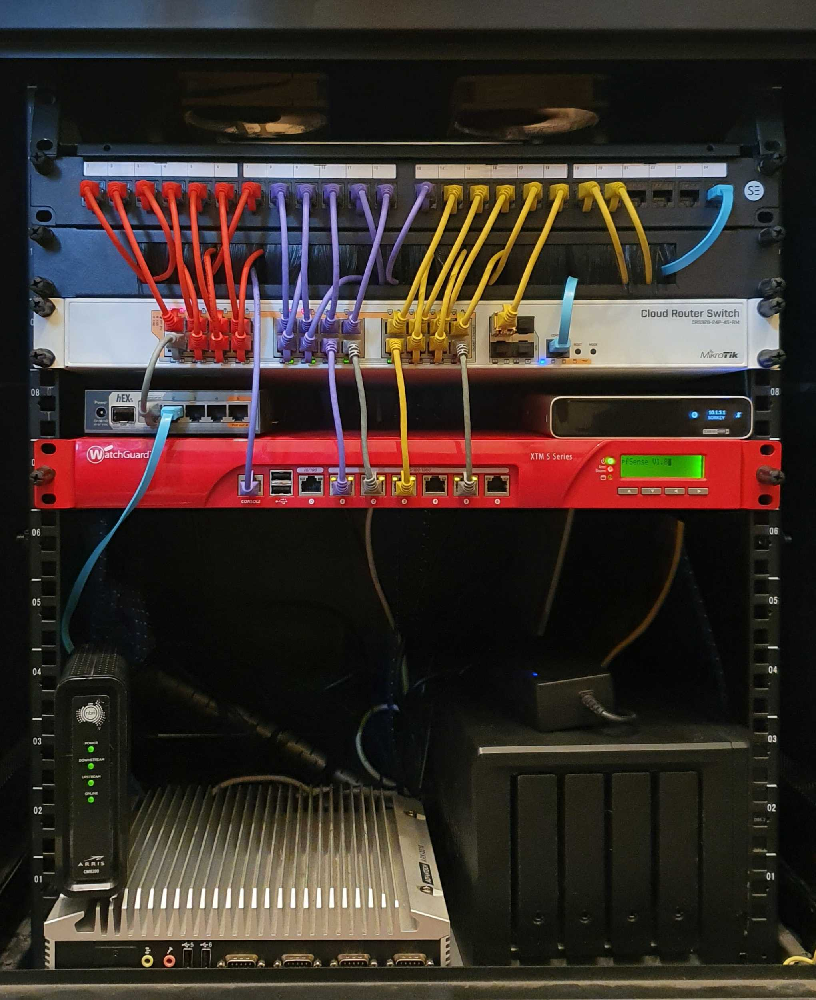

* the red box is an old retired xtm firewall applicance that I repurposed into a pfsense router + firewall. there is a frankenstein of noctua fans and ssds floating around in there
* it acts as a enterprisey equiv boundary from home network and home lab. my normal connection acting as the public internet to it
* 24 port mikrotik POE switch (love this thing)
* mikrotik Hex s for routing
* ubiquti cloud key for encrypted DNS and NVR
* cost of cat6 >> the cloud key + router cost....

Dell R610 server I got bought decommissioned ($350). Came with 48GB ram, one or more of the sticks were dogey so I bought an A4 sandwhich bag of second hand RAM and swapped sticks until it didn't whinge There are more banks to fill, but I am 1 short or so.

proxmox + hardware topology overview, which i use to for VMs. initially I experimented each of the VMS running different OSs to get a feel for which made for the easier process and maintenance. ubuntu was the choice, but the jury is still out here (I commited just so I could ansible)

a kube dump of the nodes running in one cluster

the running pods in kubes itself which makeup the game instances and the distributed memory cluster

pipeline doing some pipelining (jenkins) and due to happenstance also shows the end of the UI layer test run

